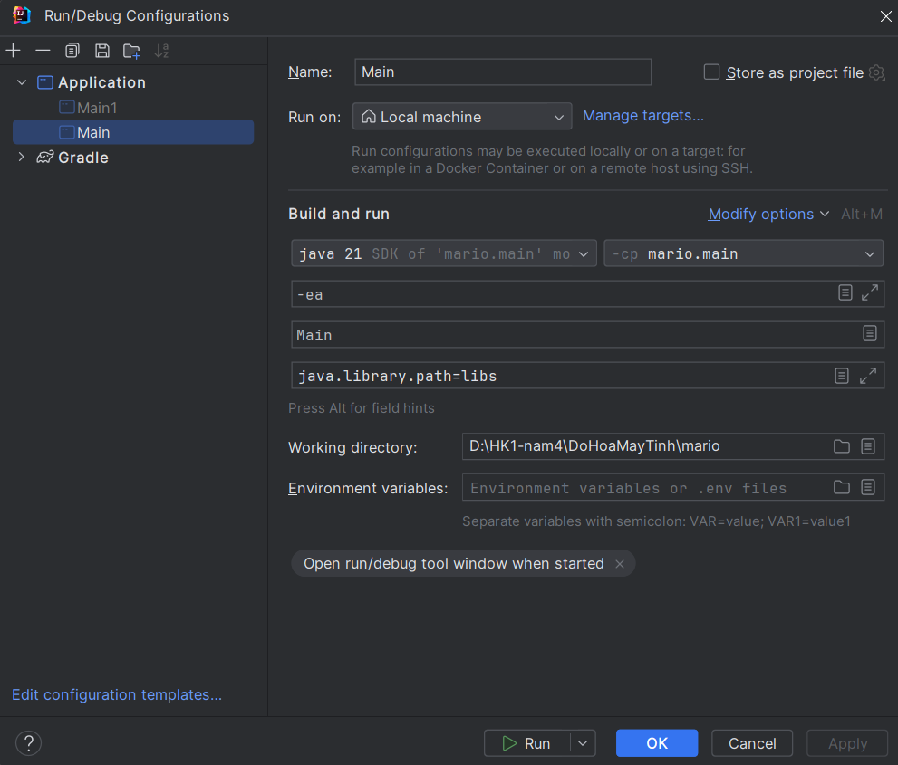

## Player

`A` hoac `←` de di chuyen sang trai

`D` hoac `→` de di chuyen sang phai

`W` hoac `↑` hoac `space` de nhay

## Mod

Vao `Windown.java` thay doi 

`public static final boolean RELEASE_BUILD = true` => che do nguoi choi

`public static final boolean RELEASE_BUILD = false` => che do tuy chinh

`E` Di chuyen vat the

`R` Thu/Phong vat the

`Ctrl + D` Nhan doi(x2) vat the

`Delete` Xoa vat the

`Space` Dich chuyen man hinh ve giua

Nhan + giu nut chuc nang ben hong chuot de di chuyen man hinh. Co the tuy chinh trong `EditorCamera.java`

```
 public void editorUpdate(float dt) {
 ...
 }
```

Nhan + giu keo chuot trai de chon vung doi tuong (nhan `esc` de huy chon)

Dich chuyen 1/10 block `Shift`:
+ `←` dich chuyen vat the sang trai
+ `→` dich chuyen vat the sang phai
+ `↑` dich chuyen vat the len tren
+ `↓` dich chuyen vat the xuong duoi

Dich chuyen 1 block:
+ `←` dich chuyen vat the sang trai
+ `→` dich chuyen vat the sang phai
+ `↑` dich chuyen vat the len tren
+ `↓` dich chuyen vat the xuong duoi

`Page Up` +1 zIndex cua chu the 

`Page Down` -1 zIndex cua chu the 

Run configurations

